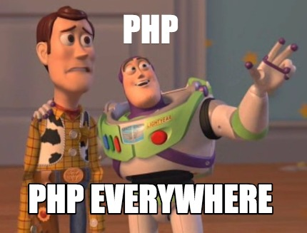

# Laboratori **Ingegneria del software** 2022/23

Questa repository contiene il materiale per i laboratori del corso di Ingegneria del software per l'anno 2022/23.


## Le P del programmatore
- **P**rima
- **P**ensa
- **P**oi
- **P**rogramma
- **P**erchè
- **P**rogrammi
- **P**oco
- **P**ensati
- **P**ossono 
- **P**ortare
- **P**arecchi
- **P**roblemi


## Ambiente di sviluppo
I laboratori ed il progetto saranno sviluppati nell'ambiente fornito a lezione e scaricabile al seguente link usando il linguaggio di programmazione PHP. 



Dopo aver scaricato il file .zip, decomprimerlo in ``C:\``; il risultato dovrà essere il seguente: avere una cartella ``C:\isw\`` con il seguente contenuto.

```
./
├───composer/
├───lib/
├───xampp/
├───projects/
├───vs-code
└───xampp-controll
```


### Composer
``composer`` è un gestore di dipendenze a livello di applicazione per il linguaggio di programmazione PHP che fornisce un formato standard per la gestione delle dipendenze del software PHP e delle librerie necessarie. Lo sviluppo è iniziato nell'aprile 2011 ed è stato rilasciato per la prima volta il 1° marzo 2012. Composer è fortemente ispirato a "npm" di Node.js e a "bundler" di Ruby. 
Composer viene eseguito dalla riga di comando e installa le dipendenze (ad esempio le librerie) per un'applicazione. Consente inoltre agli utenti di installare le applicazioni PHP disponibili su "Packagist", che è il suo repository principale contenente i pacchetti disponibili. Fornisce anche funzionalità di autocaricamento per le librerie che specificano le informazioni di autocaricamento per facilitare l'uso di codice di terze parti. 

### Lib
``lib`` è una cartella contenente le librerie che useremo durante i laboratori. In particolare, ne useremo due: PHPMailer e FPDF... no spoiler!


### Xampp
``xampp`` è un pacchetto gratuito e open-source di soluzioni multipiattaforma per server web sviluppato da Apache Friends, composto principalmente da Apache HTTP Server, database MariaDB e interpreti per script scritti nei linguaggi di programmazione PHP e Perl. Poiché la maggior parte delle distribuzioni di server web attuali utilizza gli stessi componenti di XAMPP, rende possibile la transizione da un server di prova locale a un server live. La facilità di distribuzione di XAMPP significa che uno stack WAMP o LAMP può essere installato in modo rapido e semplice su un sistema operativo da uno sviluppatore. 

### Projects
``projects`` è una cartella vuota dove andremo a sviluppare gli esercizi dei laboratori e il progetto finale.


### Vs-code
``vs-code`` è l'editor di testo che useremo per scrivere codice PHP degli esercizi e del progetto.

### Xampp-controll 
``xampp-control`` è il pannello di controllo che ci permette di avviare il server web.

&nbsp;

---
&nbsp;
## [**LAB-1**](lab-1/README.md)
### Teoria
- Mail server e protocollo SMTP
- Funzione nativa *mail()* VS libreria *PHPMailer*
- Panoramica libreria ``PHPMailer``

### Pratica
- Esercizio invio mail in PHP


&nbsp;
## [**LAB-2**](lab-2/README.md)
### Teoria
- Generare file PDF in PHP
- Panoramica libreria ``FPDF``

### Pratica 
- Esercizio generazione pdf


---
&nbsp;
## **LAB-3**
### Teoria
- Importanza della fase di testing
- Cosa sono i test di unità
- PHPUnit

### Pratica
- Esercizio di testing (ancora devo pensarci)

---
&nbsp;
## **LAB-4**
### Teoria
- Wordpress

### Pratica
- Installazione wp


