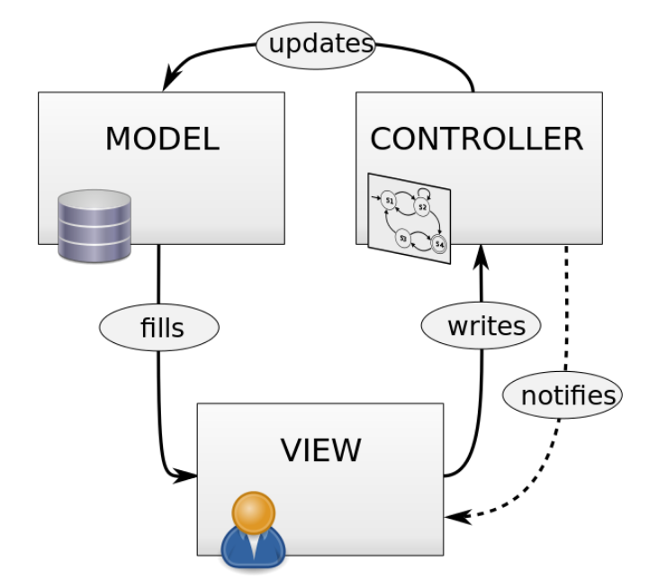

# Laboratorio 0
In questo laboratorio faremo un recap sull'ingegneria del software. Daremo la definizione di paradigma MVC.

# Teoria


## Le P del programmatore
- **P**rima
- **P**ensa
- **P**oi
- **P**rogramma
- **P**erchè
- **P**rogrammi
- **P**oco
- **P**ensati
- **P**ossono 
- **P**ortare
- **P**arecchi
- **P**roblemi


## Criteri di qualità del codice


Uno dei problemi più comuni degli sviluppatori è quello dei nomi. A volte passiamo più tempo a leggere il codice che a scriverlo, quindi una buona denominazione ripaga sempre in futuro. L'uso di buoni nomi rende il codice migliore e più pulito. Aiuta a identificare intuitivamente le responsabilità di ciascuna parte del codice. Rende la vostra applicazione facilmente leggibile in futuro da altri sviluppatori. La notazione ``snake_case`` utilizza parole in minuscolo separate da trattini bassi _. Questo è il formato suggerito, poiché i trattini bassi facilitano la lettura della variabile e non aggiungono troppo alla lunghezza del nome della variabile. Questa notazione viene utilizzata generalmente per nominare le variabili.
La notazione ``camelCase`` o ``CamelCase`` utilizza la prima lettera maiuscola delle parole nel nome di una variabile per facilitarne la lettura. 
Una buona pratica è usare la notazione a camello con la prima lettera maiuscola per dichiarare classi o interfacce, mentre con la minuscola per dichiarare funzioni e metodi.

- lunghezza delle funzioni
- Responsabilità delle classi 


## Paradigma MVC




&nbsp;


## Struttura di un progetto MVC
```
./
├───index.php
├───css/
├───js/
├───lib/
├───utils/
└───src/
    ├───controllers/
    ├───models/
    └───views/
```


* ``./``, root del progetto
* ``index.php``, rappresenta l'entry point della nostra applicazione
* ``css/``, cartella dove inseriremo i fogli di stile (file .css)
* ``js/``, cartella dove inseriremo il codice javascript (file .js)
* ``utils/``, cartella dove inseriremo le classi php con cui sviluppiamo la logica di business
* ``src/``, cartella dove contenente 3 sottocartelle, in cui svilupperemo il paradigma MVC:
    * ``models/``
    * ``views/``
    * ``controller/``

*"Un posto per ogni cosa, ogni cosa al suo posto"*

**Cosa è la logica di business o logica di dominio? E qual è il posto giusto all'interno di un progetto?**
La logica di business o logica di dominio è quella parte del programma che codifica le regole di business del mondo reale che determinano come i dati possono essere creati, memorizzati e modificati. Essa prescrive il modo in cui gli oggetti di business interagiscono tra loro e impone i percorsi e i metodi con cui gli oggetti di business vengono acceduti e aggiornati. Tale logica è incorporata nelle classi di servizio. 

## Service classes
L'idea delle classi di servizio non è integrata nel framework o documentata nella documentazione ufficiale. Di conseguenza, le persone si riferiscono ad esse in modo diverso. 
Non essendo integrate all'interno di Laravel, non c'è un comando artisan make per creare una classe di servizio. Si possono tenere le classi dove si vuole. Una buona soluzione è mettere le nostre classi di servizio in ``app/Services``.


&nbsp;
# Pratica
Esercizio somma tra due numeri: crea una vista con un form, aggiungi le rotte, aggiungi un controller che gestisca le richieste, aggiungi una classe di servizio che risolva il calcolo


