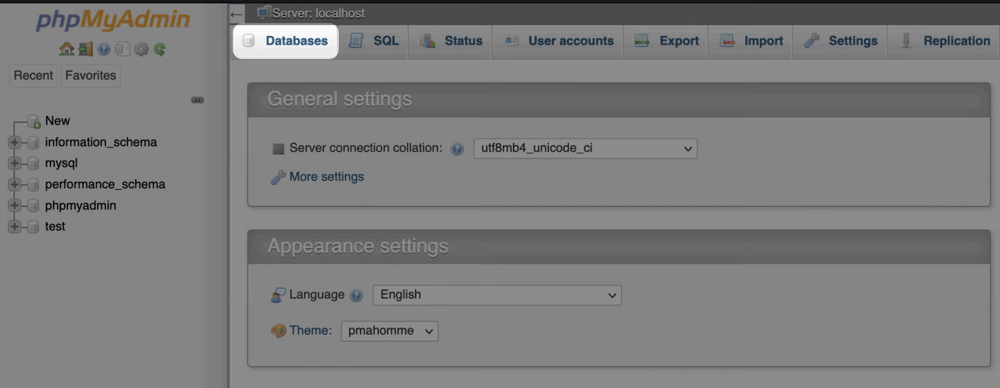
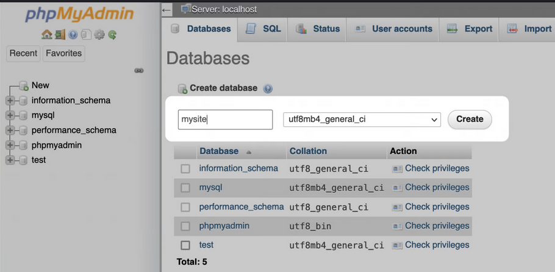
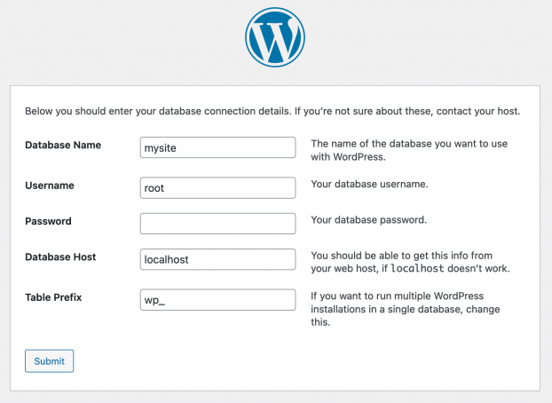

# Laboratorio 3
In questo laboratorio studieremo uno dei sistemi di gestione di contenuti più diffuso: [Wordpress](https://wordpress.com)

## Teoria
WordPress è un sistema di gestione di contenuti (content management system CMS) gratuito e open-source scritto in linguaggio preprocessore ipertestuale e basato su database relazionale MySQL o MariaDB con supporto HTTPS; è stato rilasciato per la prima volta il 27 maggio 2003 da due fondatori: Matt Mullenweg, sviluppatore americano, e Mike Little, sviluppatore britannico. Le sue caratteristiche includono un'architettura di plugin e un sistema di template, che all'interno di WordPress vengono chiamati theme/temi. WordPress è stato originariamente creato come sistema di pubblicazione di blog, ma si è evoluto per supportare altri tipi di contenuti Web, tra cui le mailing list e i forum più tradizionali di Internet, le gallerie multimediali, i siti associativi, i sistemi di gestione dell'apprendimento e i negozi online. 

Per funzionare, WordPress deve essere installato su un server Web, sia che faccia parte di un servizio di hosting Internet come WordPress.com, sia che si tratti di un computer che esegue il pacchetto software WordPress.org per fungere da host di rete a sé stante. Un computer locale può essere utilizzato per scopi di prova e di apprendimento da un singolo utente.

## Installazione di Wordpress
Per poter eseguire WordPress è necessario avviare il database MySQL e il server web Apache. Possiamo avviarli dal pannello di controllo di xampp che troviamo su ``C:\isw\xampp-controll``

Dopo aver scaricato il pacchetto dal sito del corso, decomprimere in ``C:\isw\projects\``

Le parti di un sito web WordPress sono due: 
- database
- backend 

### Database

Per crearne uno per il vostro sito, visitate http://localhost/phpmyadmin.

In questo modo si accede a **PhpMyAdmin**, il pannello di gestione che aiuta a creare e gestire i database. Gran parte di questo strumento va oltre lo scopo di questa lezione, anche se è semplice creare un database. Creiamo il database che permetterà alla nostra instanza wp di essere eseguita

Dopo dobbiamo specificare il nome del database dove faremo il deployment. Assegnamo il nome ``db_isw`` alla nostra instanza Mysql.

In questo modo otteniamo un database MySql vuoto che il backend utilizzerà durante l'esecuzione.

### Backend
Scarichiamo il pacchetto wp dal sito del corso, decomprimiamolo in ``C:\isw\projects\``, rinominare il la cartella "wordpress-6.1-it_IT" in "deployment".

Collegarsi all'indirizzo http://localhost/final_project/ e seguire gli step guidati per l'installazione. Valorizzare il campo "Nome del database" del form a cui saremo reindirizzati con la stringa "db_isw": In questo modo specifichiamo a Wordpress il database a cui fare riderimento. I restanti campi possono essere lasciati vuoti/con i valori di default.

Valorizzare come riportato di seguito i campi del form a cui saremo reindirizzati (quelli non specificati possono essere lasciati vuoti).
* Site Title: isw
* Username: admin
* Password: admin
* spuntare il flag: Conferma l'uso della password debole
* La tua mail: inserire un valore casuale es. pippo@unipi.it

Infine, effettuare il login con le credenziali admin, admin. In questo modo saremo reindirizzati sulla dashboard di Wordpress.
La dashboard di wp sarà accessibile all'indirizzo http://localhost/deployment/wp-admin. 