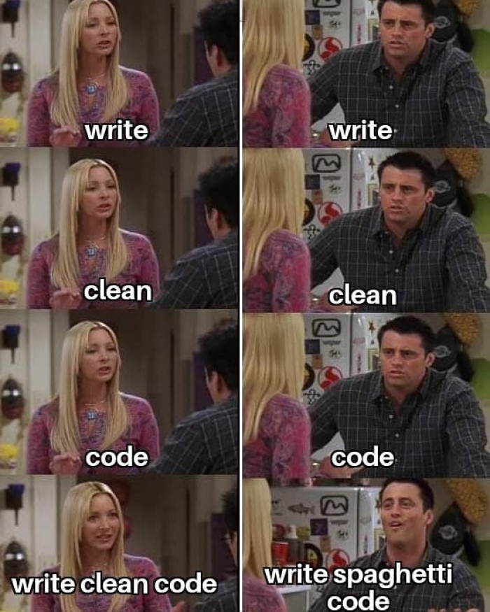

# Laboratorio 4
In questo laboratorio studieremo alcuni test statici per fare clean code.




## Teoria
Code sniffer è un test statico che utilizza l'analisi statica del codice per rilevare le violazioni degli standard di codice definiti e per prevenire gli errori di codice più comuni.

In questi laboratori, noi useremo ``PHP_CodeSniffer``. PHP_CodeSniffer è un insieme di due script PHP: lo script principale ``phpcs`` che tokenizza i file **PHP**, **JavaScript** e **CSS** per rilevare le violazioni di uno standard di codifica definito e un secondo script ``phpcbf`` per correggere automaticamente le violazioni dello standard di codifica. PHP_CodeSniffer è uno strumento di sviluppo essenziale che garantisce la pulizia e la coerenza del codice.

apri il terminale e 

```
phpcs --standard=<std> <file_name>
```

```
phpcbf --standard=<std> <file_name>
```

Gli standard secondo cui un codice può essere validato sono i seguenti (in alternativa è possibile definire un proprio standard):
* PEAR
* PSR1
* PSR2
* Squiz
* Zend
* **PSR12** (da usare nel progettto)


## Pratica
Nel nostro pacchetto troveremo il modulo per l'analisi del codice nella root del pacchetto, all'interno della cartella ``PHP_CodeSniffer``.

Creiamo un nuovo progetto chiamato clean_code; creiamo un nuovo file in cui copiamo il seguente codice e salviamolo come clean_code.php

```php
<?php


$msg1 = 'hello';
$msg2 = 'world';

echo $msg1 . ' ' . $msg2;

?>
```

Apriamo il terminale di windows e spostiamoci nella root del nostro pacchetto isw
```
cd C:\isw
```

Validiamo il codice php contenuto nel file che abbiamo appena creato. 
```
PHP_CodeSniffer\bin\phpcs --standard=PSR12 --colors xampp\htdocs\clean_code\clean_code.php
```

Correggiamo eventuali errori che sono presenti.
```
PHP_CodeSniffer\bin\phpcbf --standard=PSR12 --colors xampp\htdocs\clean_code\clean_code.php
```
